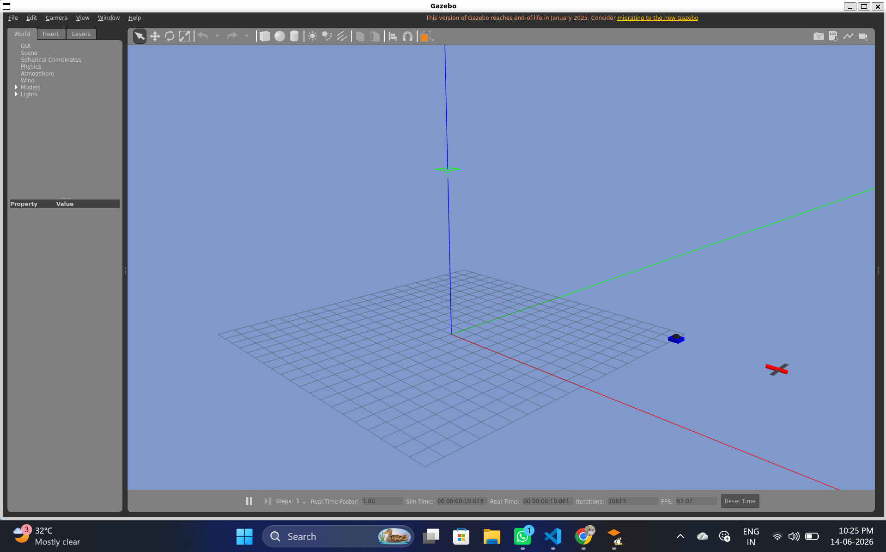
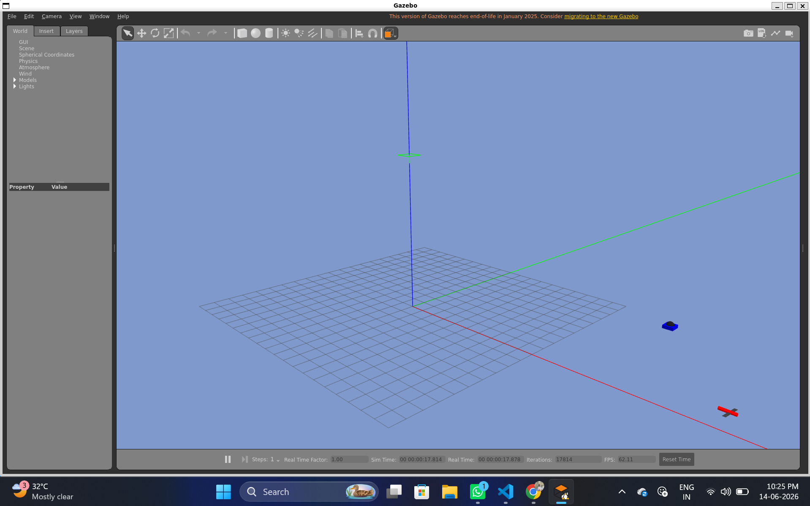
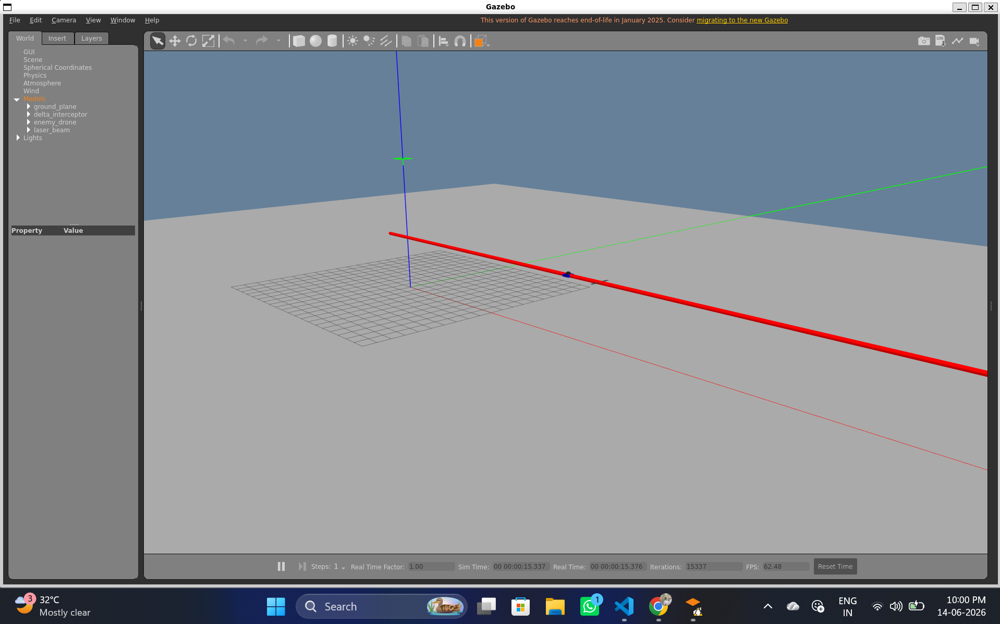

# Autonomous Drone Interceptor System:

Air-to-Air drone interception tracking system built using ROS2 and Gazebo.

## Interception Mission Sequence:

### 1. System Launch & Target Detection


### 2. Autonomous Tracking Loop


### 3. Target Neutralization (Kill Zone Trigger)


## How to Run
```bash
cd ~/fresh_drone_ws
source install/setup.bash
ros2 launch drone_tracking super_launch.py
